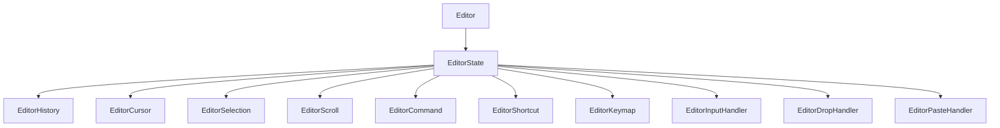

# 编辑器系统

Better Markdown 编辑器基于 Monaco Editor 提供了一个强大且可扩展的编辑器系统。它允许你创建一个功能齐全的 Markdown 编辑器,并自定义其功能和行为。

## 1. 编辑器系统架构

下面的 Mermaid 图展示了编辑器系统的主要组件及其关系:



- `Editor`: 核心编辑器组件,渲染 Monaco Editor 实例。
- `EditorState`: 管理编辑器的各种状态,如光标位置、选区、滚动位置、历史记录等。
- `EditorHistory`: 管理编辑器的撤销/重做历史记录。
- `EditorCursor`: 管理编辑器中的光标位置和移动。
- `EditorSelection`: 管理编辑器中的文本选区。
- `EditorScroll`: 管理编辑器的滚动行为。
- `EditorCommand`: 提供一组常用的编辑器命令,如格式化、插入链接、图片等。
- `EditorShortcut`: 为编辑器命令配置键盘快捷键。
- `EditorKeymap`: 为编辑器配置自定义按键映射。
- `EditorInputHandler`: 处理编辑器中的输入事件,如自动补全、建议等。
- `EditorDropHandler`: 处理编辑器中的拖放事件,如插入图片、附件等。
- `EditorPasteHandler`: 处理编辑器中的粘贴事件,如粘贴图片、HTML 等。

## 2. 在 Vue 项目中使用编辑器

要在 Vue 项目中使用编辑器系统,请按照以下步骤操作:

1. 从 `@/core/editor` 导入 `Editor` 组件和其他必要的模块:

```js
import { Editor } from '@/core/editor'
```

2. 在模板中使用 `Editor` 组件:

```html
<template>
  <Editor 
    v-model="content" 
    :options="editorOptions"
    @change="handleChange"
  />
</template>
```

3. 在组件的脚本中配置编辑器选项:

```js
import { defineComponent, ref } from 'vue'
import { Editor, defaultEditorConfig } from '@/core/editor'

export default defineComponent({
  components: {
    Editor
  },
  setup() {
    const content = ref('')
    const editorOptions = ref({
      ...defaultEditorConfig,
      // 在此处覆盖或添加自定义选项
    })

    function handleChange(value) {
      // 处理编辑器内容变化
    }

    return {
      content,
      editorOptions,
      handleChange
    }
  }
})
```

4. 根据需要自定义编辑器选项、事件和扩展。

## 3. 编辑器选项

编辑器接受一个 `options` 属性来配置其行为和外观。你可以使用 `defaultEditorConfig` 对象作为起点,并根据需要覆盖特定选项。

一些常用的选项包括:

- `value`: 编辑器的初始内容。
- `language`: 编辑器内容的语言(默认为 'markdown')。
- `theme`: 编辑器的颜色主题(默认为 'vs')。
- `lineNumbers`: 是否显示行号(默认为 true)。
- `lineWrapping`: 是否启用自动换行(默认为 false)。
- `readonly`: 编辑器是否为只读(默认为 false)。
- `fontSize`: 编辑器的字体大小(默认为 14)。
- `fontFamily`: 编辑器的字体系列(默认为 'Consolas, "Courier New", monospace')。
- `wordWrap`: 编辑器的自动换行方式(默认为 'off')。
- `minimap`: 是否启用迷你地图(默认为 { enabled: false })。
- `scrollbar`: 自定义滚动条选项。
- `overviewRulerLanes`: 概览标尺选项。
- `lineDecorationsWidth`: 行装饰宽度。
- `lineNumbersMinChars`: 行号最小字符数。
- `folding`: 是否启用代码折叠(默认为 true)。
- `glyphMargin`: 是否启用字形边距(默认为 false)。
- `suggest`: 自定义代码建议选项。

你可以在 `@/core/editor/interface.ts` 中找到完整的编辑器选项列表。

## 4. 编辑器事件

编辑器组件会触发一些事件,你可以监听这些事件来执行自定义逻辑。

一些常见的事件包括:

- `change`: 当编辑器内容发生变化时触发。
- `focus`: 当编辑器获得焦点时触发。
- `blur`: 当编辑器失去焦点时触发。
- `scroll`: 当编辑器滚动时触发。
- `keydown`: 当按下键盘按键时触发。
- `keyup`: 当释放键盘按键时触发。

你可以使用 `v-on` 指令或 `@` 简写来监听这些事件:

```html
<Editor 
  @change="handleChange"
  @focus="handleFocus"
  @blur="handleBlur"
  @scroll="handleScroll"
  @keydown="handleKeyDown"
  @keyup="handleKeyUp"
/>
```

然后在组件的脚本中定义相应的事件处理函数:

```js
function handleChange(value) {
  // 处理内容变化
}

function handleFocus() {
  // 处理获得焦点
}

function handleBlur() {
  // 处理失去焦点
}

function handleScroll(scrollTop) {
  // 处理滚动
}

function handleKeyDown(event) {
  // 处理按键按下
}

function handleKeyUp(event) {
  // 处理按键释放
}
```

## 5. 编辑器命令

编辑器提供了一组内置命令,你可以使用这些命令执行常见的操作,如格式化文本、插入链接、图片等。

要执行命令,你可以调用 `EditorCommand` 实例上的相应方法:

```js
import { useEditor } from '@/core/editor'

const { state } = useEditor()

state.command.undo() // 撤销
state.command.redo() // 重做
state.command.bold() // 加粗
state.command.italic() // 斜体
state.command.underline() // 下划线
state.command.strikethrough() // 删除线
state.command.heading(1) // 标题1
state.command.heading(2) // 标题2
state.command.heading(3) // 标题3
state.command.heading(4) // 标题4
state.command.heading(5) // 标题5
state.command.heading(6) // 标题6
state.command.paragraph() // 段落
state.command.quote() // 引用
state.command.list('bullet') // 无序列表
state.command.list('ordered') // 有序列表
state.command.list('task') // 任务列表
state.command.code() // 代码块
state.command.table() // 表格
state.command.link() // 链接
state.command.image() // 图片
state.command.clear() // 清空内容
```

你可以在 `@/core/editor/EditorCommand.ts` 中找到可用命令的完整列表。

## 6. 编辑器快捷键

编辑器支持为执行命令配置自定义键盘快捷键。你可以使用 `EditorShortcut` 类来配置快捷键。

要定义快捷键,请创建一个 `EditorShortcut` 实例,并传入编辑器实例和命令实例:

```js
import { useEditor, EditorShortcut } from '@/core/editor'

const { state } = useEditor()
const shortcut = new EditorShortcut(state.editor, state.command)

shortcut.addShortcut('Ctrl+B', 'bold')
shortcut.addShortcut('Ctrl+I', 'italic')
shortcut.addShortcut('Ctrl+U', 'underline')
// ...
```

`addShortcut` 方法接受两个参数:快捷键组合和命令名称。

## 7. 编辑器按键映射

除了快捷键之外,你还可以使用 `EditorKeymap` 类为编辑器定义自定义按键映射。

要定义按键映射,请创建一个 `EditorKeymap` 实例,并传入编辑器实例和命令实例:

```js
import { useEditor, EditorKeymap } from '@/core/editor'

const { state } = useEditor()
const keymap = new EditorKeymap(state.editor, state.command)

keymap.addKeymap('Enter', 'newline')
keymap.addKeymap('Backspace', 'deleteBackward')
keymap.addKeymap('Delete', 'deleteForward')
// ...
```

`addKeymap` 方法接受两个参数:按键名称和命令名称。

## 8. 编辑器扩展

编辑器系统的设计具有可扩展性,允许你通过扩展添加自定义功能和行为。

一些内置的扩展包括:

- `EditorInputHandler`: 处理编辑器中的输入事件,如自动补全、建议等。
- `EditorDropHandler`: 处理编辑器中的拖放事件,如插入图片、附件等。
- `EditorPasteHandler`: 处理编辑器中的粘贴事件,如粘贴图片、HTML 等。

你可以通过扩展适当的基类并覆盖必要的方法来创建自己的扩展。

例如,要创建一个自定义输入处理程序:

```js
import { EditorInputHandler } from '@/core/editor'

class MyInputHandler extends EditorInputHandler {
  handleInput(event) {
    // 自定义输入处理逻辑
  }
}
```

然后,将扩展附加到编辑器状态:

```js
import { useEditor } from '@/core/editor'

const { state } = useEditor()
state.inputHandler = new MyInputHandler(state.editor)
```

## 9. 总结

Better Markdown 编辑器提供了一个丰富而灵活的编辑器系统,你可以轻松地将其集成到你的 Vue 项目中。凭借其模块化架构和可扩展设计,你可以根据自己的特定需求和要求自定义编辑器。

通过利用 Monaco Editor 的强大功能和编辑器系统的简单性,你可以为用户创建高质量的 Markdown 编辑体验。

欢迎探索源代码和文档,以了解有关编辑器系统的更多信息,以及如何充分利用其功能。祝你编码愉快! 