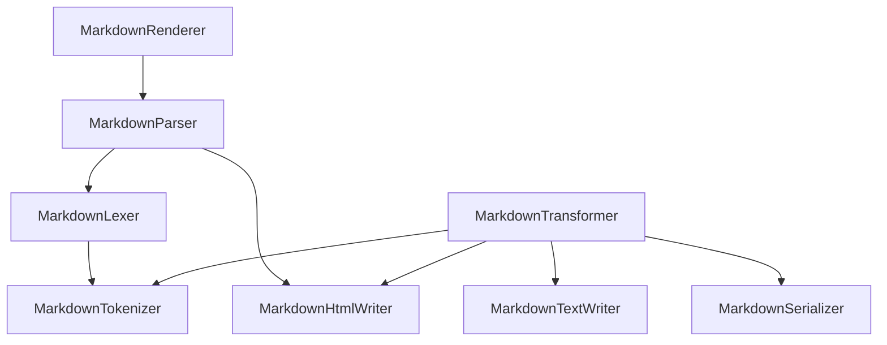

# Markdown 模块

Better Markdown 编辑器提供了一个强大的 Markdown 解析和渲染模块,允许你将 Markdown 文本转换为 HTML 或其他格式,并支持通过插件扩展 Markdown 语法和功能。

## 1. Markdown 模块架构

下面的 Mermaid 图展示了 Markdown 模块的主要组件及其关系:



- `MarkdownParser`: 负责解析 Markdown 文本,生成 Token 列表并转换为 HTML。
- `MarkdownLexer`: 负责将 Markdown 文本分解为 Token。
- `MarkdownTokenizer`: 负责将 Markdown 文本转换为 Token 列表。
- `MarkdownTransformer`: 负责将 Markdown 文本转换为 HTML 或其他格式。
- `MarkdownHtmlWriter`: 负责将 Token 列表渲染为 HTML 字符串。
- `MarkdownTextWriter`: 负责将 Token 列表渲染为纯文本格式的 Markdown。
- `MarkdownSerializer`: 负责将 Token 列表序列化为 Markdown 字符串。
- `MarkdownRenderer`: Vue 组件,负责将 Markdown 文本解析并渲染为 HTML。

## 2. 在 Vue 项目中使用 Markdown 模块

要在 Vue 项目中使用 Markdown 模块,你可以直接使用 `MarkdownRenderer` 组件,或者使用 `MarkdownParser` 类来手动解析和渲染 Markdown。

### 2.1 使用 MarkdownRenderer 组件

`MarkdownRenderer` 是一个 Vue 组件,它封装了 Markdown 解析和渲染的逻辑,使你可以轻松地在模板中渲染 Markdown 内容。

1. 从 `@/core/markdown` 导入 `MarkdownRenderer` 组件:

```js
import { MarkdownRenderer } from '@/core/markdown'
```

2. 在模板中使用 `MarkdownRenderer` 组件:

```html
<template>
  <MarkdownRenderer :value="markdownText" :options="markdownOptions" />
</template>
```

3. 在组件的脚本中定义 `markdownText` 和 `markdownOptions`:

```js
import { defineComponent, ref } from 'vue'
import { MarkdownRenderer } from '@/core/markdown'

export default defineComponent({
  components: {
    MarkdownRenderer
  },
  setup() {
    const markdownText = ref('# Hello, Markdown!')
    const markdownOptions = ref({
      gfm: true,
      breaks: true,
      // ...
    })

    return {
      markdownText,
      markdownOptions
    }
  }
})
```

### 2.2 使用 MarkdownParser 类

如果你需要更细粒度的控制,或者想要手动解析和渲染 Markdown,你可以直接使用 `MarkdownParser` 类。

1. 从 `@/core/markdown` 导入 `MarkdownParser` 类:

```js
import { MarkdownParser } from '@/core/markdown'
```

2. 创建 `MarkdownParser` 实例并配置选项:

```js
const parser = new MarkdownParser({
  gfm: true,
  breaks: true,
  // ...
})
```

3. 使用 `parse` 方法解析 Markdown 文本:

```js
const html = parser.parse('# Hello, Markdown!')
```

4. 将生成的 HTML 插入到页面中:

```js
document.getElementById('preview').innerHTML = html
```

## 3. Markdown 解析器选项

`MarkdownParser` 和 `MarkdownRenderer` 组件都接受一个 `options` 参数,用于配置 Markdown 解析器的行为。以下是一些常用的选项:

- `gfm`: 是否启用 GitHub Flavored Markdown 扩展(默认为 `true`)。
- `tables`: 是否启用表格支持(默认为 `true`)。
- `breaks`: 是否将换行符转换为 `<br>` 标签(默认为 `false`)。
- `pedantic`: 是否启用严格模式(默认为 `false`)。
- `smartypants`: 是否启用智能标点替换(默认为 `false`)。
- `emoji`: 是否启用 Emoji 替换(默认为 `true`)。
- `renderer`: 自定义渲染器,用于自定义 Markdown 元素的渲染方式。

你可以在 `@/core/markdown/interface.ts` 中找到完整的解析器选项列表。

## 4. 自定义 Markdown 渲染

Markdown 模块允许你通过自定义渲染器来自定义 Markdown 元素的渲染方式。你可以覆盖默认的渲染方法,或者添加对新的 Markdown 元素的支持。

要创建自定义渲染器,你需要实现 `MarkdownRenderer` 接口:

```js
import type { MarkdownRenderer } from '@/core/markdown'

const customRenderer: MarkdownRenderer = {
  heading(text, level) {
    return `<h${level} class="custom-heading">${text}</h${level}>`
  },
  link(href, title, text) {
    return `<a href="${href}" title="${title}" target="_blank">${text}</a>`
  },
  // ...
}
```

然后,将自定义渲染器传递给 `MarkdownParser` 或 `MarkdownRenderer` 组件:

```js
const parser = new MarkdownParser({
  renderer: customRenderer
})
```

```html
<MarkdownRenderer :value="markdownText" :options="{ renderer: customRenderer }" />
```

## 5. 扩展 Markdown 语法

Markdown 模块支持通过插件来扩展 Markdown 语法和功能。你可以创建自定义插件来添加新的语法元素、渲染规则或者转换功能。

要创建一个 Markdown 插件,你需要实现 `MarkdownExtension` 接口:

```js
import type { MarkdownExtension } from '@/core/markdown'

const customExtension: MarkdownExtension = {
  name: 'custom',
  level: 'block',
  start(src) {
    // 在解析开始前对 Markdown 源文本进行预处理
    return src
  },
  tokenizer(src) {
    // 将匹配到的内容转换为 Token
    const tokens = []
    // ...
    return tokens
  },
  renderer(token) {
    // 将 Token 渲染为 HTML
    return `<div class="custom">${token.text}</div>`
  }
}
```

然后,使用 `use` 方法将插件添加到 `MarkdownParser` 或 `MarkdownTransformer` 中:

```js
const parser = new MarkdownParser()
parser.use(customExtension)
```

```js
const transformer = new MarkdownTransformer()
transformer.use(customExtension)
```

## 6. Markdown AST 操作

Markdown 模块提供了一个 `MarkdownWalker` 类,用于遍历和操作 Markdown 抽象语法树(AST)。你可以使用它来分析和转换 Markdown 文档的结构。

要使用 `MarkdownWalker`,首先需要解析 Markdown 文本得到 Token 列表:

```js
const parser = new MarkdownParser()
const tokens = parser.parse(markdownText)
```

然后,创建一个 `MarkdownWalker` 实例并传入 Token 列表和遍历选项:

```js
import { MarkdownWalker } from '@/core/markdown'

const walker = new MarkdownWalker(tokens, {
  enter(token) {
    // 在进入节点时调用
    console.log('Enter:', token.type)
  },
  leave(token) {
    // 在离开节点时调用
    console.log('Leave:', token.type)
  }
})
```

最后,调用 `walk` 方法开始遍历 AST:

```js
walker.walk()
```

在遍历过程中,你可以对 Token 进行分析和修改,以实现自定义的转换功能。

## 7. 工具函数

Markdown 模块还提供了一些实用的工具函数,可以帮助你处理 Markdown 相关的任务。这些函数位于 `@/core/markdown/MarkdownUtils.ts` 文件中。

- `slugify(str: string): string`: 将字符串转换为 URL 友好的 slug 格式。
- `unescapeAll(str: string): string`: 反转义 HTML 实体。
- `escapeHtml(str: string): string`: 转义 HTML 字符。
- `isBlank(str: string): boolean`: 检查字符串是否为空白。
- `replaceEntities(str: string): string`: 替换 HTML 实体。
- `cleanUrl(sanitize: (url: string) => string, base: string, href: string): string`: 清理并验证 URL。
- `resolveUrl(base: string, href: string): string`: 解析相对 URL 为绝对 URL。
- `splitCells(tableRow: string, count: number): string[]`: 将表格行拆分为单元格。
- `rtrim(str: string, c: string): string`: 从字符串末尾移除指定字符。
- `findClosingBracket(str: string, start: number): number`: 查找匹配的右括号位置。
- `checkSanitizeDeprecation(opt: MarkdownParserOptions): void`: 检查过时的 sanitize 选项。
- `repeatString(pattern: string, count: number): string`: 重复字符串多次。
- `getUnescape(str: string): (m: string) => string`: 获取反转义函数。
- `normalizeReference(str: string): string`: 规范化引用标签。
- `isSpace(code: number): boolean`: 检查字符是否为空格。
- `isWhiteSpace(code: number): boolean`: 检查字符是否为空白字符。
- `isMdAsciiPunct(code: number): boolean`: 检查字符是否为 ASCII 标点符号。
- `isPunctChar(code: number): boolean`: 检查字符是否为标点符号。
- `escapeRE(str: string): string`: 转义正则表达式中的特殊字符。
- `scanDelims(str: string, start: number): [number, number, number]`: 扫描分隔符。
- `buildInlineTokens(tokens: Token[]): Token[]`: 构建行内 Token 列表。
- `highlightCode(code: string, lang: string): string`: 高亮代码。
- `wrapTable(header: string, body: string): string`: 包装表格。
- `parseTableRow(content: string): string[]`: 解析表格行。
- `parseTableAlign(content: string): ('left' | 'center' | 'right' | null)[]`: 解析表格对齐方式。
- `parseTableCell(content: string): string`: 解析表格单元格。

你可以直接从 `@/core/markdown` 导入这些函数,并在需要时使用它们。例如:

```js
import { slugify, unescapeAll } from '@/core/markdown'

const slug = slugify('Hello, World!')
const text = unescapeAll('&lt;p&gt;Hello, World!&lt;/p&gt;')
```

## 8. 小结

Better Markdown 编辑器的 Markdown 模块提供了强大而灵活的 Markdown 解析和渲染功能。通过使用 `MarkdownParser`、`MarkdownTransformer` 等类,你可以轻松地将 Markdown 文本转换为 HTML 或其他格式。

同时,Markdown 模块还支持自定义渲染器和插件,使你能够扩展和自定义 Markdown 的语法和渲染方式,满足不同场景下的需求。

此外,`MarkdownWalker` 类提供了遍历和操作 Markdown AST 的能力,使你能够对 Markdown 文档进行深入的分析和转换。

最后,Markdown 模块还提供了一些实用的工具函数,帮助你处理 Markdown 相关的任务,提高开发效率。

希望通过这篇文档,你能够全面了解 Better Markdown 编辑器的 Markdown 模块,并在实际开发中灵活运用它的各项功能,打造出更加优秀的 Markdown 应用。
