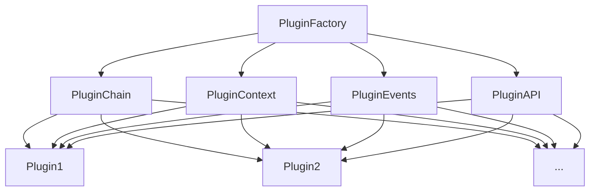

# 插件工厂与插件管理

在 Markdown 编辑器的插件系统中,`PluginFactory` 类扮演着核心的角色,它负责管理插件的创建、使用以及插件之间的协作。除此之外,还有几个重要的类参与插件的管理和执行,它们分别是 `PluginChain`、`PluginContext`、`PluginEvents` 和 `PluginAPI`。

下面我们来详细了解这些类的设计思想和职责。

## 1. PluginFactory

`PluginFactory` 是插件的核心管理者,它的主要职责包括:

- 创建和实例化插件
- 管理插件的注册和使用
- 协调 `PluginChain`、`PluginContext`、`PluginEvents` 和 `PluginAPI` 之间的合作
- 提供插件的查询和操作方法

可以说,`PluginFactory` 就像一个插件系统的"中枢",所有的插件管理和调度都通过它来完成。

## 2. PluginChain

`PluginChain` 是插件的执行链,它的主要职责包括:

- 管理插件的注册顺序
- 定义插件的执行顺序和优先级
- 提供插件的过滤和查询方法

当我们通过 `PluginFactory` 注册一个插件时,实际上就是将插件添加到 `PluginChain` 中。在 Markdown 解析和渲染的过程中,`PluginChain` 会按照注册的顺序依次执行插件。

## 3. PluginContext

`PluginContext` 是插件的上下文环境,它的主要职责包括:

- 提供插件运行时所需的上下文信息
- 管理和调用插件的渲染方法
- 处理插件与 Markdown 解析器之间的数据交换

可以说,`PluginContext` 就是插件的"运行时",插件的执行和渲染都在 `PluginContext` 中进行。

## 4. PluginEvents

`PluginEvents` 是插件的事件系统,它的主要职责包括:

- 管理插件的事件注册和触发
- 提供插件间通信和协作的机制
- 扩展插件的功能和灵活性

通过 `PluginEvents`,插件可以监听和触发自定义的事件,实现插件间的通信和协作。这大大增强了插件的扩展能力。

## 5. PluginAPI

`PluginAPI` 是插件的接口类,它的主要职责包括:

- 提供插件注册、卸载、查询等方法
- 提供插件配置的读取和设置方法
- 提供编辑器实例、状态等上下文信息
- 提供事件的监听和触发接口

可以说,`PluginAPI` 是插件与编辑器、其他插件之间通信的桥梁,插件可以通过 `PluginAPI` 获取编辑器的各种资源和状态,也可以通过它来调用其他插件的功能。

## 6. 架构图

下面是一张简单的架构图,展示了 `PluginFactory`、`PluginChain`、`PluginContext`、`PluginEvents` 和 `PluginAPI` 之间的关系和协作:

从图中可以看出:

- `PluginFactory` 是整个插件系统的核心,它协调 `PluginChain`、`PluginContext`、`PluginEvents` 和 `PluginAPI` 的工作
- `PluginChain` 管理插件的注册和执行顺序
- `PluginContext` 提供插件的运行环境和上下文
- `PluginEvents` 提供插件的事件机制
- `PluginAPI` 提供插件的接口和通信机制
- 所有的插件都通过这几个类进行管理、调度和通信

## 7. 小结

`PluginFactory`、`PluginChain`、`PluginContext`、`PluginEvents` 和 `PluginAPI` 共同组成了 Markdown Better 编辑器插件系统的核心。它们各司其职,协同工作,提供了一套完善、灵活、高效的插件管理方案。

通过这套插件系统,我们可以方便地扩展 Markdown Better 编辑器的功能,满足不同场景下的需求。同时,插件间的松耦合设计也保证了系统的可维护性和可扩展性。

希望通过这篇文档,你能更好地理解 Markdown Better 编辑器插件系统的设计思想和架构。如果你对插件开发感兴趣,不妨动手实践,相信你会有更深刻的体会。
