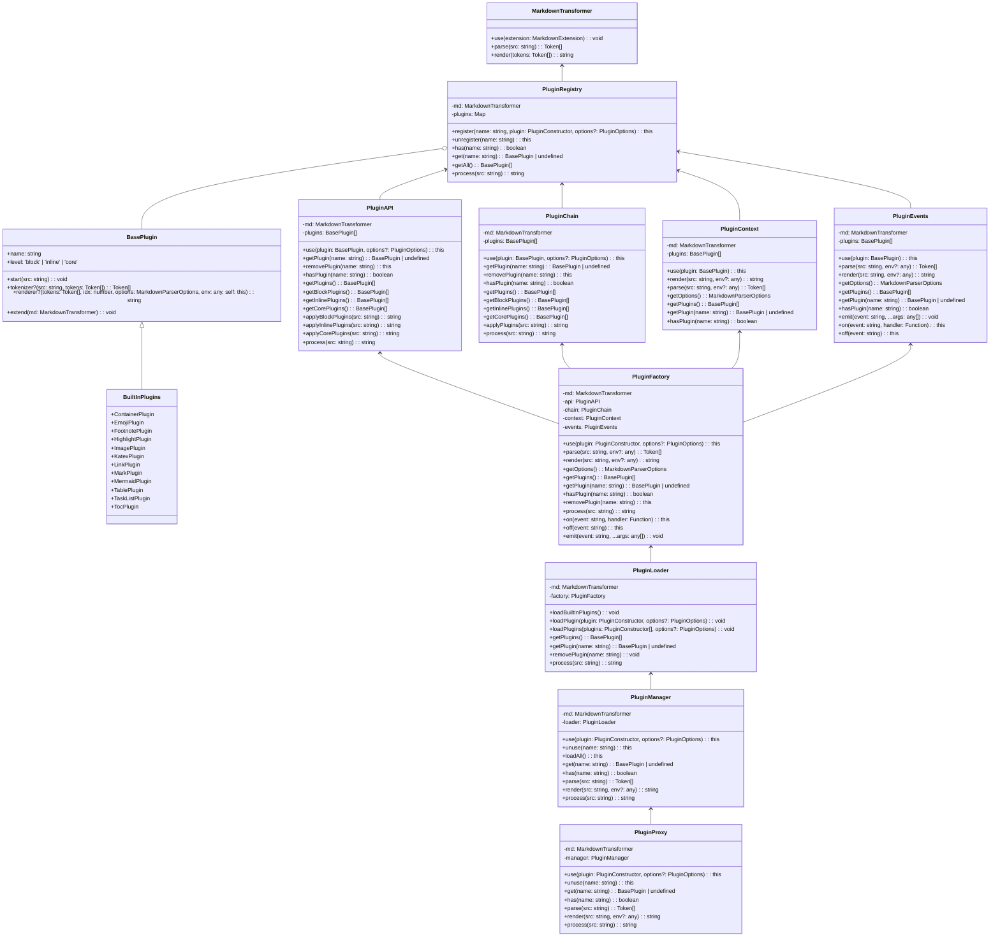

# 插件系统

Markdown Better编辑器提供了一套灵活的插件系统，允许你通过编写插件来扩展和定制编辑器的功能。插件可以修改编辑器的解析、渲染行为，以支持额外的语法和功能。

## 1. 插件的类型

根据插件的作用范围和时机,可以将插件分为以下几类：

- Parser插件：扩展Markdown的解析规则和Token流；
- Renderer插件：自定义Token的渲染逻辑和最终输出；
- Extension插件：以上两类的结合,同时扩展解析和渲染；
- Addon插件：不修改编辑器行为,而是提供额外的工具和UI。

一个插件可以实现多种类型,但通常专注于一种能力会更加内聚。

## 2. 插件的结构

一个插件就是一个JavaScript对象，其中包含一些预定义的属性和方法，编辑器会在合适的时机调用它们。插件对象的基本结构如下:

```js
{
  // 必须的属性
  name: 'my-plugin', // 插件的名称,必须唯一
  level: 'block', // 插件的类型,可以是 core、block、inline 之一

  // 可选的属性  
  enable: true, // 插件是否启用
  options: {}, // 插件的配置选项

  // 插件的方法

  // 插件的初始化方法,在插件被注册时调用
  onInit() {},

  // 插件的启用方法,在插件被启用时调用  
  onEnable() {},

  // 插件的禁用方法,在插件被禁用时调用
  onDisable() {},

  // 插件的核心方法,处理Markdown源码
  start(src) {
    // 对src进行处理,返回处理后的结果
    return src
  },

  // 插件的语法解析方法,将源码解析为Token流
  tokenizer(src, tokens) {
    // 对src进行解析,返回新的Token流
    return tokens  
  },

  // 插件的渲染方法,将Token流渲染为最终的HTML
  renderer(tokens, idx, options, env, self) {
    // 对tokens[idx]进行渲染,返回渲染后的HTML
    return ''
  }
}
```

## 3. 插件的注册和使用

你可以通过MarkdownTransformer的use方法来注册一个插件：

```js
import { MarkdownTransformer } from 'markdown-transformer'
import MyPlugin from './MyPlugin'

const md = new MarkdownTransformer()

// 注册插件
md.use(MyPlugin, {
  // 传入插件的配置选项
  option1: true,
  option2: 'foo'
})
```

use方法接受插件对象和配置选项作为参数,会自动实例化插件,调用插件的onInit方法,然后将插件注册到内部的插件注册表中。

注册后的插件会根据其level属性自动参与到编辑器的解析和渲染流程中：

- core插件会在每次解析之前调用start方法；
- block插件会在解析block token时调用tokenizer和renderer方法；
- inline插件会在解析inline token时调用tokenizer和renderer方法。

你也可以通过MarkdownTransformer的unuse方法来取消注册一个插件:

```js
// 取消注册插件
md.unuse('my-plugin')
```

unuse方法接受插件的name作为参数，会自动调用插件的onDisable方法，然后将插件从注册表中移除。

## 4. 插件的配置

每个插件都可以接受一个options对象作为配置选项，插件可以在options中声明自己支持的配置项，然后在初始化时通过构造函数获取到这些配置。

例如:

```js
export default class MyPlugin {
  constructor(options = {}) {
    this.options = Object.assign({}, MyPlugin.defaultOptions, options)
  }

  static defaultOptions = {
    enabled: true,
    foo: 'bar'
  }

  onInit() {
    console.log(this.options.enabled) // true
    console.log(this.options.foo) // 'bar'
  }
}
```

然后在注册插件时传入配置项即可覆盖默认配置：

```js
md.use(MyPlugin, {
  enabled: false,
  foo: 'baz'  
})
```

## 5. 插件的启用和禁用

你可以通过设置插件的enable属性为true或false来动态启用或禁用一个插件，例如：

```js
// 禁用插件
md.getPlugin('my-plugin').enable = false

// 启用插件  
md.getPlugin('my-plugin').enable = true
```

当插件的enable属性发生变化时，编辑器会自动调用插件的onEnable或onDisable方法，插件可以在这两个方法中执行一些状态的初始化或清理工作。

## 6. 插件的异常处理

如果插件在运行过程中抛出了异常，编辑器会自动捕获异常，禁用该插件，并在控制台输出错误信息，以避免影响到其他插件和编辑器本身的运行。

插件可以通过try-catch块来捕获可能的异常，并进行适当的处理，例如：

```js
{
  start(src) {
    try {
      // 可能抛出异常的代码
      return src.replace(/foo/g, 'bar')
    } catch (err) {
      console.error('MyPlugin error:', err)
      return src
    }
  }  
}
```

## 7. 插件的打包和发布

你可以将编写好的插件打包为一个独立的JS模块，并发布到NPM仓库中，以便其他人安装和使用。

一个插件模块的基本结构如下：

```
my-plugin
├── src
│   └── index.js  
├── dist
│   └── index.js
├── package.json
└── README.md
```

其中:

- src目录存放插件的源代码
- dist目录存放插件的编译后代码
- package.json声明插件的元数据和依赖
- README.md提供插件的说明文档

你可以在package.json中添加如下的脚本命令：

```json
{
  "scripts": {
    "build": "babel src --out-dir dist",
    "prepublish": "npm run build"  
  }
}
```

然后通过npm publish命令将插件发布到NPM仓库：

```bash
npm publish
```

发布后,其他人就可以通过npm install命令安装你的插件：

```bash
npm install my-plugin
```

然后在代码中导入插件并注册到编辑器中：

```js
import MyPlugin from 'my-plugin'

md.use(MyPlugin)
```

## 8. 插件的示例

下面是一个简单的插件示例，用于将Markdown中的:smile:替换为😊表情符号：

```js
export default {
  name: 'emoji',
  level: 'inline',
  
  start(src) {
    return src.replace(/:smile:/g, '😊')
  }
}
```

这个插件通过正则表达式匹配:smile:文本，并将其替换为😊表情符号，从而实现了表情符号的渲染功能。

你可以在此基础上继续扩展，支持更多的表情符号和自定义映射关系，以满足不同的需求。

## 9. 架构图

插件系统为Markdown Better编辑器提供了强大的扩展能力，你可以通过编写插件来自定义编辑器的解析和渲染行为，添加新的语法支持和功能特性。

编辑器内置了一些常用的插件，如表格、代码高亮、LaTex等，你可以直接使用它们。同时欢迎你为编辑器贡献更多的优秀插件，让Markdown Better编辑器变得更加强大和易用。


