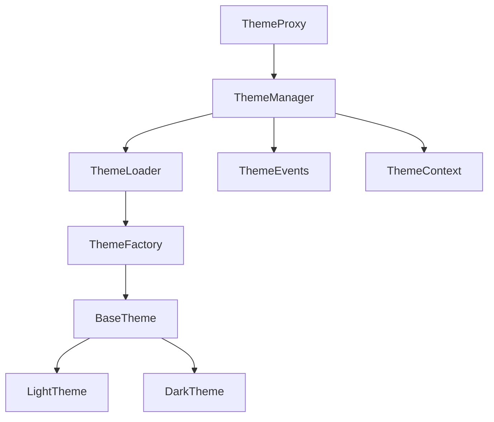

# 主题系统

Better Markdown 编辑器提供了一套灵活的主题系统,允许你通过创建主题对象来自定义编辑器的外观和样式。主题可以修改编辑器的配色、字体、布局等各个方面,也可以控制 Markdown 解析和渲染的行为。

## 1. 主题系统架构

下面是一个 Mermaid 图,展示了主题系统的主要组件和它们之间的关系:



- `ThemeProxy` 是主题系统的入口,提供了一个统一的接口来访问主题管理器的功能。
- `ThemeManager` 是主题的管理器类,负责加载、注册和切换主题。
- `ThemeLoader` 是主题的加载器类,负责从文件系统或网络加载主题。
- `ThemeFactory` 是主题的工厂类,负责创建主题实例。
- `ThemeEvents` 是主题的事件类,提供了一种在主题变化时触发事件的机制。
- `ThemeContext` 是主题的上下文类,提供了一种在组件树中共享主题状态的方式。
- `BaseTheme` 是所有主题类的基类,定义了主题的基本属性和方法。
- `LightTheme` 和 `DarkTheme` 是两个内置的主题类,分别表示浅色和深色主题。

## 2. 在 Vue 项目中使用主题

要在 Vue 项目中使用主题系统,你需要执行以下步骤:

1. 创建一个或多个主题类,继承自 `BaseTheme`,实现 `apply` 方法。

2. 已在 `src/core/theme/index.ts` 中导出主题类。

3. 在 `src/store/modules/theme.ts` 中创建一个 Pinia Store 来管理主题状态:

```js
import { defineStore } from 'pinia'
import { ref } from 'vue'
import { ThemeProxy } from '@/core/theme'

export const useThemeStore = defineStore('theme', () => {
  const themeProxy = new ThemeProxy()
  const currentTheme = ref(themeProxy.getCurrentTheme())

  function setTheme(name) {
    themeProxy.setCurrentTheme(name)
    currentTheme.value = themeProxy.getCurrentTheme()
  }

  return {
    currentTheme,
    setTheme
  }
})
```

4. 在 `src/App.vue` 中注册你的主题,并将主题状态注入到 Vue 应用中:

```html
<script setup>
import { onMounted } from 'vue'
import { useThemeStore } from './store/modules/theme'
import { MyTheme } from './core/theme'

const themeStore = useThemeStore()

onMounted(() => {
  themeStore.themeProxy.registerTheme(new MyTheme())
  themeStore.setTheme('my-theme')
})
</script>
```

5. 在需要使用主题的组件中,通过 `useThemeStore` 来访问当前主题:

```html
<script setup>
import { computed } from 'vue' 
import { useThemeStore } from '../store/modules/theme'

const themeStore = useThemeStore()
const currentThemeName = computed(() => themeStore.currentTheme.name)
</script>

<template>
  <div :class="currentThemeName">
    <!-- 组件内容 -->
  </div>
</template>
```

现在,你的 Vue 应用就可以使用主题系统了。你可以通过 `setTheme` 方法来切换不同的主题,主题的样式会自动应用到对应的组件中。

## 3. 主题的结构

一个主题就是一个继承自 `BaseTheme` 的 JavaScript 类,其中包含一些预定义的属性和方法,编辑器会在合适的时机调用它们。一个基本的主题类结构如下:

```js
import { BaseTheme } from './BaseTheme'

class MyTheme extends BaseTheme {
  constructor() {
    super({
      name: 'my-theme',
      style: {
        backgroundColor: '#fff',
        color: '#000'
      },
      markdown: {
        gfm: true,
        tables: true,
        breaks: false  
      }
    })
  }
  
  apply() {
    // 应用主题样式
    const style = `
      .markdown-body {
        color: #333;
      }
    `
    const styleEl = document.createElement('style')
    styleEl.innerHTML = style
    document.head.appendChild(styleEl)
  }
}
```

- `name`: 主题的名称,必须唯一
- `style`: 主题的默认样式,一个 CSS 属性的对象
- `markdown`: 主题的 Markdown 解析器选项
- `apply`: 主题的应用方法,用于插入主题样式到页面中

通过 `super` 调用父类的构造函数,可以设置主题的基本属性。在 `apply` 方法中,可以通过操作 DOM 来应用主题的样式。

## 4. 主题的注册和使用

你可以通过 `ThemeManager` 的 `register` 方法来注册一个主题:

```js
import { ThemeManager } from './ThemeManager'
import MyTheme from './MyTheme'

const manager = new ThemeManager()

// 注册主题
manager.registerTheme(new MyTheme())
```

`registerTheme` 方法接受一个主题实例作为参数,会将其添加到内部的主题注册表中。

注册后的主题可以通过 `setCurrentTheme` 方法来激活:

```js
// 设置当前主题
manager.setCurrentTheme('my-theme')
```

`setCurrentTheme` 方法接受主题的名称作为参数,会查找对应的主题实例,调用其 `apply` 方法,并触发主题切换事件。

你也可以通过 `getTheme` 方法来获取一个已注册的主题实例:

```js
// 获取主题实例
const theme = manager.getTheme('my-theme')
```

## 5. 主题的切换和事件

`ThemeManager` 提供了一些方法来切换和管理主题:

- `setCurrentTheme(name)`: 设置当前激活的主题
- `getCurrentTheme()`: 获取当前激活的主题实例
- `getTheme(name)`: 根据名称获取一个主题实例
- `getThemes()`: 获取所有已注册的主题实例
- `registerTheme(theme)`: 注册一个新的主题实例
- `unregisterTheme(name)`: 注销一个已注册的主题
- `setThemeOptions(name, options)`: 设置主题的选项
- `on(event, handler)`: 监听主题事件
- `off(event, handler)`: 取消监听主题事件

你可以通过 `on` 方法来监听主题的变化事件:

```js
manager.on('change', (oldTheme, newTheme) => {
  console.log(`Theme changed from ${oldTheme.name} to ${newTheme.name}`)
})
```

当主题发生变化时,会触发 `change` 事件,回调函数会接收新旧主题实例作为参数。

你也可以通过 `off` 方法来取消监听事件:

```js
const handleChange = () => {/* ... */}
manager.on('change', handleChange)

// 取消监听
manager.off('change', handleChange)  
```

## 6. 主题的创建和自定义

你可以通过继承 `BaseTheme` 类来创建自定义的主题:

```js
import { BaseTheme } from './BaseTheme'

class CustomTheme extends BaseTheme {
  constructor() {
    super({
      name: 'custom',
      style: {
        backgroundColor: 'papayawhip',
        color: 'palevioletred'
      },
      markdown: {
        emoji: true  
      }
    })
  }
  
  apply() {
    super.apply()
    
    const style = `
      .markdown-body {
        padding: 20px;
      }
      
      .markdown-body h1 {
        border-bottom: 2px solid palevioletred;
      }
    `
    const styleEl = document.createElement('style')
    styleEl.innerHTML = style
    document.head.appendChild(styleEl)
  }
}
```

在构造函数中,通过 `super` 调用父类构造函数,可以设置主题的基本属性。

在 `apply` 方法中,先调用 `super.apply()` 应用基础主题样式,然后可以插入额外的自定义样式。

创建好自定义主题类后,通过 `ThemeManager` 的 `registerTheme` 方法注册即可使用:

```js
manager.registerTheme(new CustomTheme())
manager.setCurrentTheme('custom')
```

## 7. 主题的高级用法

### 主题选项

可以通过 `ThemeManager` 的 `setThemeOptions` 方法来设置主题的选项:

```js
manager.setThemeOptions('my-theme', {
  fontSize: '16px',
  lineHeight: 1.8
})
```

`setThemeOptions` 方法接受主题名称和选项对象作为参数,会合并到主题实例的 `options` 属性中。

在主题类中,可以通过 `this.options` 属性来访问这些选项:

```js
class MyTheme extends BaseTheme {
  constructor() {
    super({
      name: 'my-theme',
      // ...
    })
  }
  
  apply() {
    const { fontSize, lineHeight } = this.options
    
    const style = `
      .markdown-body {
        font-size: ${fontSize};
        line-height: ${lineHeight};  
      }
    `
    // ...
  }
}
```

### 主题样式

除了在 `apply` 方法中插入样式,还可以通过 `this.style` 属性来定义主题的默认样式:

```js
class MyTheme extends BaseTheme {
  constructor() {
    super({
      name: 'my-theme',
      style: {
        backgroundColor: '#f8f8f8',
        color: '#333',
        fontFamily: 'Helvetica, sans-serif'
      }
    })
  }
}
```

`this.style` 属性是一个 CSS 属性的对象,会被自动转换为 CSS 字符串并插入到页面中。

可以通过 `this.setStyle` 方法来动态修改主题样式:

```js
class MyTheme extends BaseTheme {
  // ...
  
  apply() {
    super.apply()
    
    this.setStyle({
      backgroundColor: '#fff',
      color: '#666'
    })
  }
}
```

### Markdown 解析器选项  

可以通过 `this.markdown` 属性来定义主题的 Markdown 解析器选项:

```js
class MyTheme extends BaseTheme {
  constructor() {
    super({
      name: 'my-theme', 
      markdown: {
        gfm: true,
        tables: true,
        breaks: false,
        pedantic: false,
        smartLists: true,
        smartypants: false
      }
    })
  }
}
```

`this.markdown` 属性是一个 Markdown 解析器选项的对象,会被传递给 `MarkdownTransformer` 的构造函数。

可以通过 `this.setMarkdownOptions` 方法来动态修改 Markdown 解析器选项:

```js
class MyTheme extends BaseTheme {
  // ...
  
  apply() {
    super.apply()
    
    this.setMarkdownOptions({
      gfm: false,
      breaks: true  
    })
  }
}
```

## 8. 主题 API 参考

### 8.1 BaseTheme

`BaseTheme` 是所有主题类的基类,提供了一些基本的属性和方法。

#### 属性

- `name`: 主题的名称,必须唯一
- `style`: 主题的默认样式,一个 CSS 属性的对象
- `markdown`: 主题的 Markdown 解析器选项
- `options`: 主题的选项对象

#### 方法

- `constructor(options)`: 构造函数,接受一个主题选项对象
- `apply()`: 应用主题样式和选项的方法,需要子类实现
- `setStyle(style)`: 设置主题的样式
- `setMarkdownOptions(options)`: 设置主题的 Markdown 解析器选项

### 8.2 ThemeManager

`ThemeManager` 是主题的管理器类,提供了一些方法来注册、切换和管理主题。

#### 属性

- `themes`: 一个 Map 对象,存储所有已注册的主题实例
- `currentTheme`: 当前激活的主题实例

#### 方法

- `registerTheme(theme)`: 注册一个新的主题实例
- `unregisterTheme(name)`: 注销一个已注册的主题
- `getTheme(name)`: 根据名称获取一个主题实例
- `getThemes()`: 获取所有已注册的主题实例
- `setCurrentTheme(name)`: 设置当前激活的主题
- `getCurrentTheme()`: 获取当前激活的主题实例
- `setThemeOptions(name, options)`: 设置主题的选项
- `on(event, handler)`: 监听主题事件
- `off(event, handler)`: 取消监听主题事件

#### 事件

- `change`: 当切换主题时触发,回调函数接受新旧主题实例作为参数
- `apply`: 当主题应用后触发,回调函数接受当前主题实例作为参数

### 8.3 createTheme

`createTheme` 是一个辅助函数,用于快速创建主题类。

```js
import { createTheme } from './createTheme'

const MyTheme = createTheme({
  name: 'my-theme',
  style: {
    backgroundColor: '#f8f8f8'
  },
  markdown: {
    gfm: true
  },
  apply() {
    const style = `
      .markdown-body {
        padding: 20px;
      }
    `
    const styleEl = document.createElement('style')
    styleEl.innerHTML = style
    document.head.appendChild(styleEl)
  }
})
```

`createTheme` 函数接受一个主题选项对象,返回一个继承自 `BaseTheme` 的主题类。选项对象可以包含 `BaseTheme` 的所有属性和方法。

## 9. 结语

主题系统为 Markdown 编辑器提供了强大的样式定制能力,通过创建和注册主题类,可以方便地改变编辑器的外观和行为。

你可以根据自己的需求,创建多个不同风格的主题,并在运行时动态切换。主题类也可以通过选项和事件来实现更灵活的控制。

希望通过本文,你能够深入理解 Markdown 编辑器的主题系统,并开始创建自己的个性化主题。如果你有任何问题或建议,欢迎反馈。

Happy theming!
